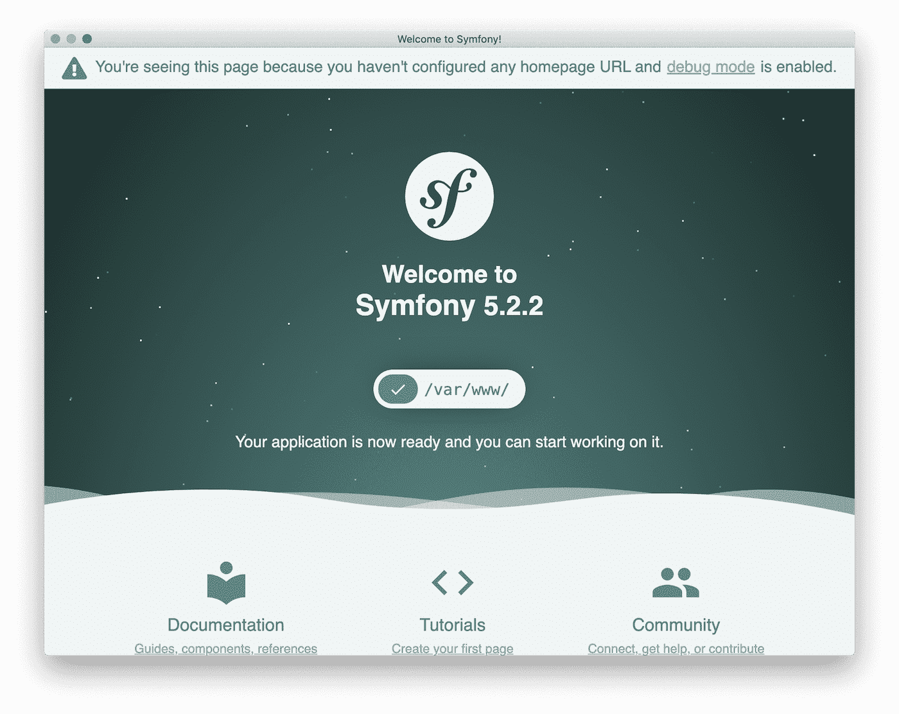

<div align="center">
    <h1 style="font-weight: bolder; margin-top: 0px" class="opacity-75">My  Heroku Symfony Starter</h1>
</div>

<div align="center">
  <p>
    <a href="#">
      
    </a>
    <a href="#">
      
    </a>
  </p>
</div>

---



## Starting started

```
git clone https://github.com/vikbert/symfony-heroku-starter.git
cd symfony-heroku-starter

make init
```

Command **symfony** can be installed with this command
```bash
curl -sS https://get.symfony.com/cli/installer | bash
```

## Open App `https://127.0.0.1:800*`
```bash
symfony serve

#[OK] Web server listening                                                                                              
#The Web server is using PHP FPM 7.4.12                         
#https://127.0.0.1:8000    
```

## Deploy to `heroku`
```bash
heroku login
heroku create
heroku config:set SYMFONY_ENV=prod
git push heroku master
```

Show the following logs
```bash
 
```


## licence

MIT [@vikbert](https://vikbert.github.io/)
